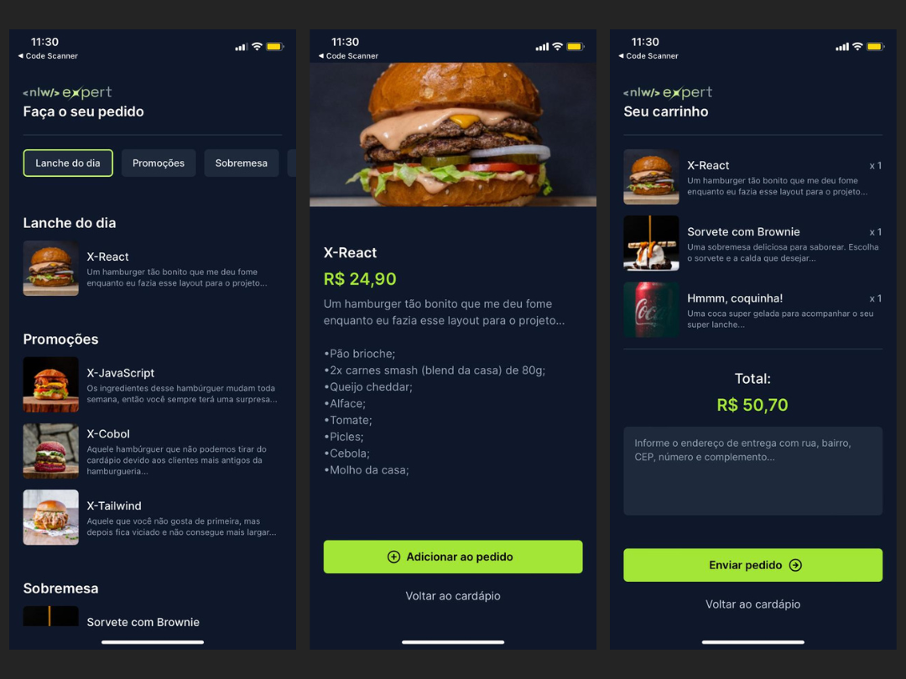

<h1 align="center"> NlW Expert - Rocketseat </h1>

Criação de um aplicativo de deliver é o projeto criado no evento NLW Expert gratuito da RocketSeat 

  <a href="#-tecnologias">Tecnologias</a>&nbsp;&nbsp;&nbsp;|&nbsp;&nbsp;&nbsp;
  <a href="#-projeto">Projeto</a>&nbsp;&nbsp;&nbsp;|&nbsp;&nbsp;&nbsp;
  <a href="#-funcionalidades">Funcionalidades</a>&nbsp;&nbsp;&nbsp;
  

 

  

## 🚀 Tecnologias

Esse projeto foi desenvolvido com as seguintes tecnologias:

- React Native
- Typescript
- TailWind
- Expo Go
- Zustand
- Git e Github
- Figma

## 💻 Projeto

Este projeto representa a criação de um aplicativo de deliveri onde o usuário faz a escolha de seus pedidos e envia as informações do pedido no whatsapp. Foi usado o React Native, Expo Go, Typescript e entre outros conhecimento para o desenvolvimento. Além disso, fazer de uma forma que assseguramos que o código seja desenvolvido de maneira semanticamente correta, prezando pela clareza e organização. O projeto foi realizado como parte do evento NLW Expert da RocketSeat ministrado pelo professor <a href="https://www.linkedin.com/in/orodrigogo/" alt="Link para o Linkedin do professor Rodrigo Gonçalves" target="_blank">Rodrigo Gonçalves</a>.

## ⚙️ Funcionalidades

O aplicativo possui as seguintes funcionalidades:

- Adicionar opções no carrinho
- Atualização das informações no carrinho
- Navegação entres as telas
- Envio do pedido no WhatsApp
